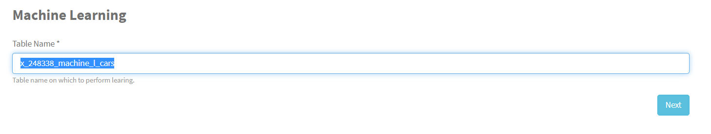
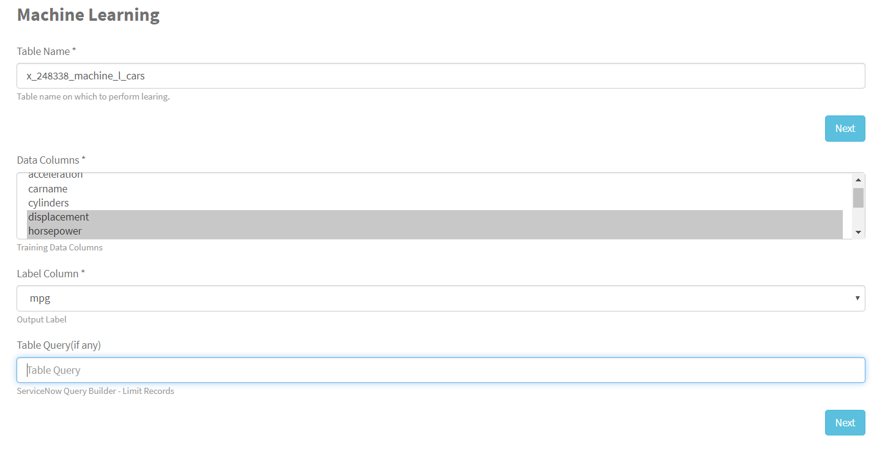
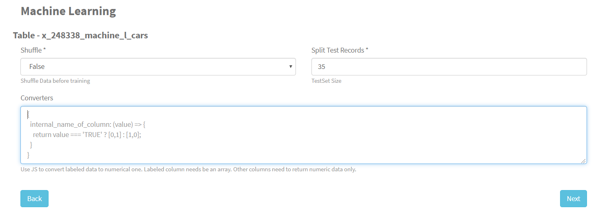
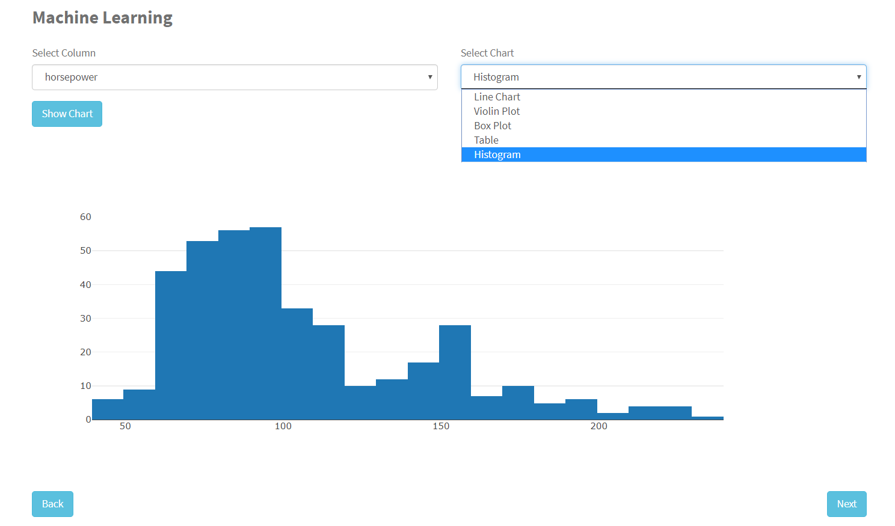
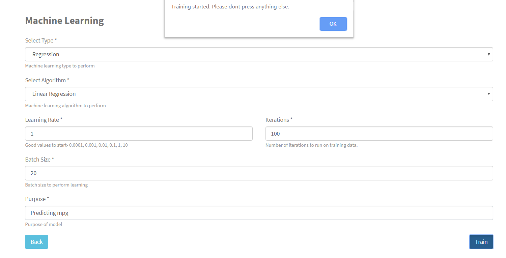
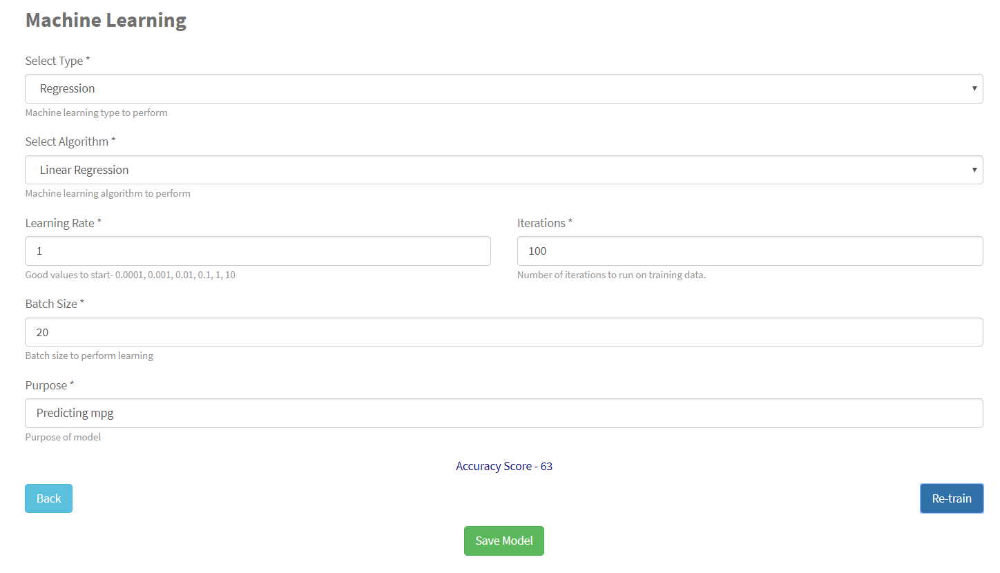
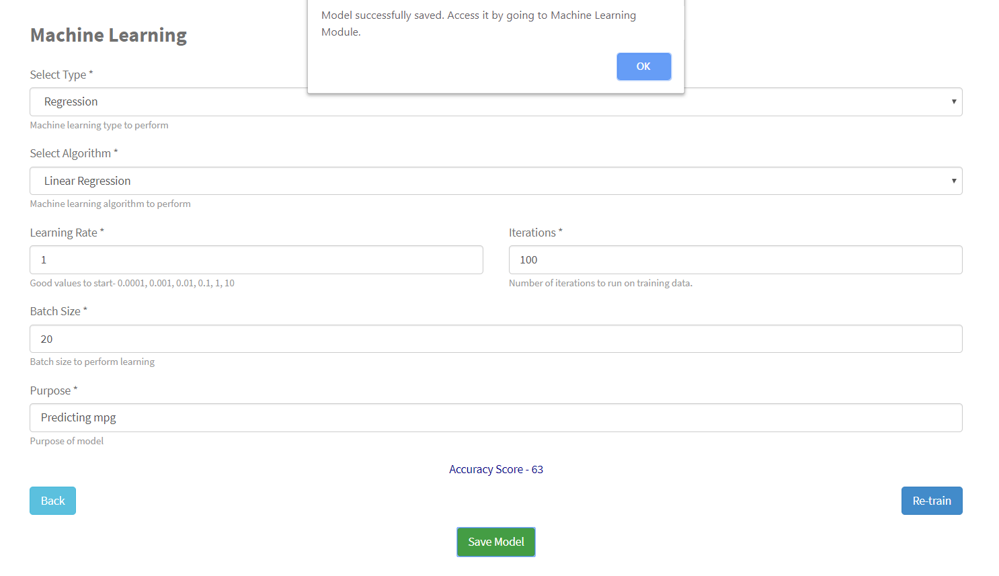
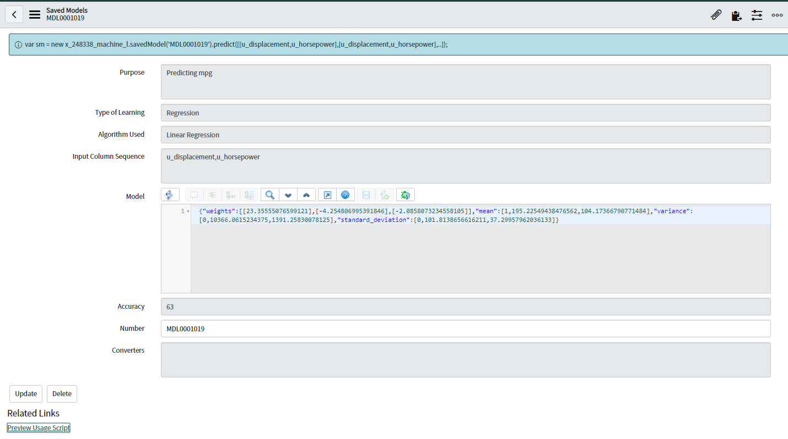

# Machine Learning on ServiceNow

Perform your Machine Learning on any table inside ServiceNow and store the model for prediction at later stages. 

Go to portal page - https://{instance-name}.service-now.com/machine_learning/?id=ml_template_page

`Step 1` : Choose table

`Step 2` : Select Training Data and Output Data

`Step3` : Select No. of Test Records to calculate accuracy. Also if you want to convert any labeled column to numerical one, use converters field. Use JavaScript in converters in the shown format.

`Step 4` : Use charts to get insights from data

`Step 5` : Select Algorithm, set learning rate, iterations and batch size and click train.

`Step 6` : Wait for model to get trained and see the accuracy. 

`Step 7` : Then save the model using Save Model button.

`Step 8` : See the saved model inside the servicenow application menu and click 'preview usage script' to get the code for use inside other scripts like Script Include, Business Rules etc. 

# Generated files
This repository contains generated files and a checksum.

**Do not edit the files in this repository outside of an instance of ServiceNow.**

If you find yourself unable to import your repository due to the presence of files edited outside an instance of ServiceNow, merge commits that mix files from different revisions, or other data that does not match the checksum, you may recover using either of the following techniques:
* Remove the problem commits:
  1. Clone your repository to a personal computer with the git command line tools installed and open a git command prompt in the repository root
  2. Run `git log` and take note of the SHA1s of the problem commits
  3. Build revert commits using `git revert SHA1` repeatedly, working backward in time, for each commit that introduced changes not generated by a ServiceNow instance
  4. Run `git push`

* Overwrite the problem code snapshot with a known good one:
  1. Clone your repository to a personal computer with the git command line tools installed and open a git command prompt in the repository root,
  2. Locate a known good code snapshot and record its SHA1. For this step, `git log` can be useful.
  2. Run `git reset --hard SHA1` to a commit that was generated by a ServiceNow instance
  3. Run `git reset HEAD{1}`
  4. Run `git add -A`
  5. Run `git commit`
  6. Run `git push`
